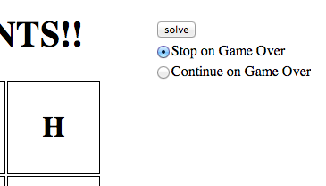

Learnist Boggle Solver
======================

[Video Demonstration](http://www.youtube.com/watch?v=2jxyx36Ck_o&hd=1)

This Chrome extension is designed to solve Boggle games as presented by the application on [the `finished` branch of the Learnist Boggle project](https://github.com/learnist/boggle/tree/finished). It should be adaptable to other versions of the project by chaging the DOM manipulation and querying functions in `src/coffee/content_script.coffee`. A similar version can be found at http://binarymuse.github.io/browser-boggle/.

The `Trie` and `Traverser` classes are generic enough to be used on any Boggle data.

The trie in `src/json/data.json` was generated from the `words` file at `/usr/share/dict/words`.

Installation
------------

 * Visit `chrome://extensions/`
 * Ensure `Developer mode` is checked
 * Click `Load unpacked extension...`
 * Locate and select the directory with the `manifest.json` file in it

Usage
-----

Visit the application (e.g. http://binarymuse.github.io/browser-boggle/) and click "New Game". The controls will load automatically on the page next to the game grid.

Hacking
-------

First, install the build dependencies with `npm install` (requires Node.js).

The files in `src/js` are compiled from the CoffeeScript files in `src/coffee`. To build the project, run `./build.sh`; you can run `./watch.sh` to start a process that will continually compile the files as you make changes.
